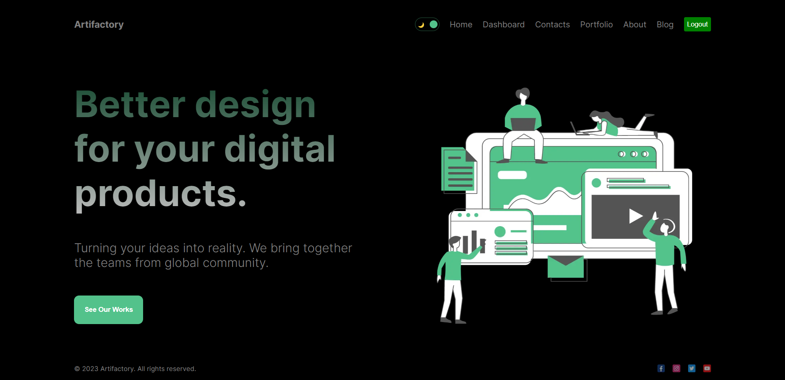
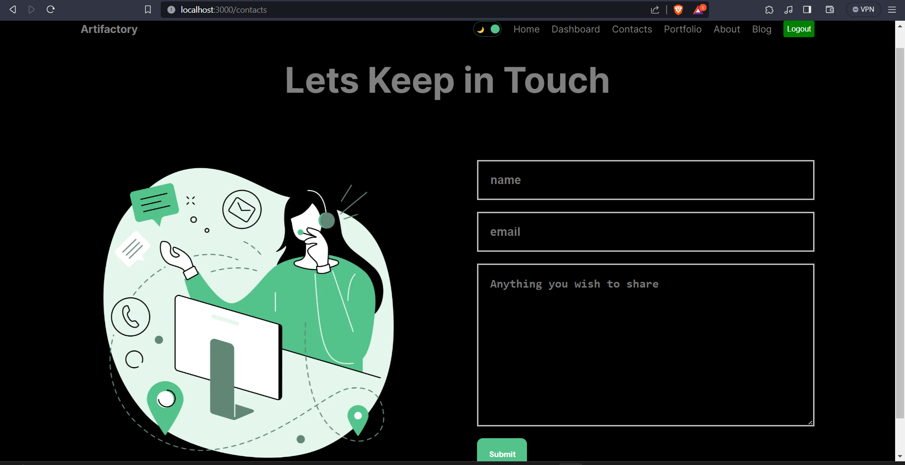
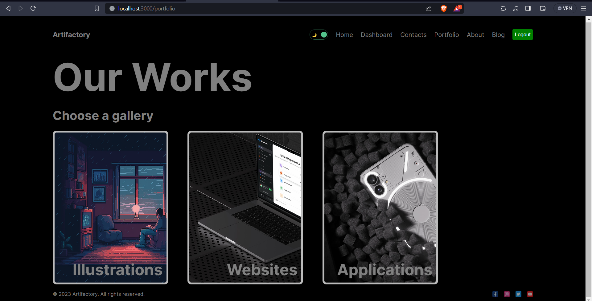

This is a [Next.js](https://nextjs.org/) project bootstrapped with [`create-next-app`](https://github.com/vercel/next.js/tree/canary/packages/create-next-app).
## Artifactory
## Description  

This is an ongoing full-stack web development project designed to showcase a modern and dynamic website. The project leverages several technologies and tools, including Next.js, JavaScript, MongoDB, and Express, to create a feature-rich web application. The primary focus of this project is to provide an interactive and visually appealing user experience while also incorporating server-side rendering and robust data management capabilities.
## Features
Front-End Technology: The project utilizes Next.js for server-side rendering, ensuring fast loading times and improved SEO. React components are used to create a responsive and dynamic user interface.

Back-End Technology: Express is employed to build the back-end server, which handles API routes and interacts with the MongoDB database. This server-side logic supports user authentication, data retrieval, and data storage.

Database: MongoDB serves as the project's database, offering a flexible and scalable solution for data storage. It provides efficient data management and retrieval capabilities.

Data Management: The application manages a wide range of data, which can include user profiles, content, images, and more. It provides features for adding, updating, and retrieving data efficiently.

Responsive Design: The website is designed to be fully responsive, ensuring a seamless experience across various devices and screen sizes.   
The website looks like :  





## Getting Started

First, run the development server:

```bash
npm run dev
# or
yarn dev
# or
pnpm dev
```

Open [http://localhost:3000](http://localhost:3000) with your browser to see the result.

You can start editing the page by modifying `app/page.js`. The page auto-updates as you edit the file.

This project uses [`next/font`](https://nextjs.org/docs/basic-features/font-optimization) to automatically optimize and load Inter, a custom Google Font.


